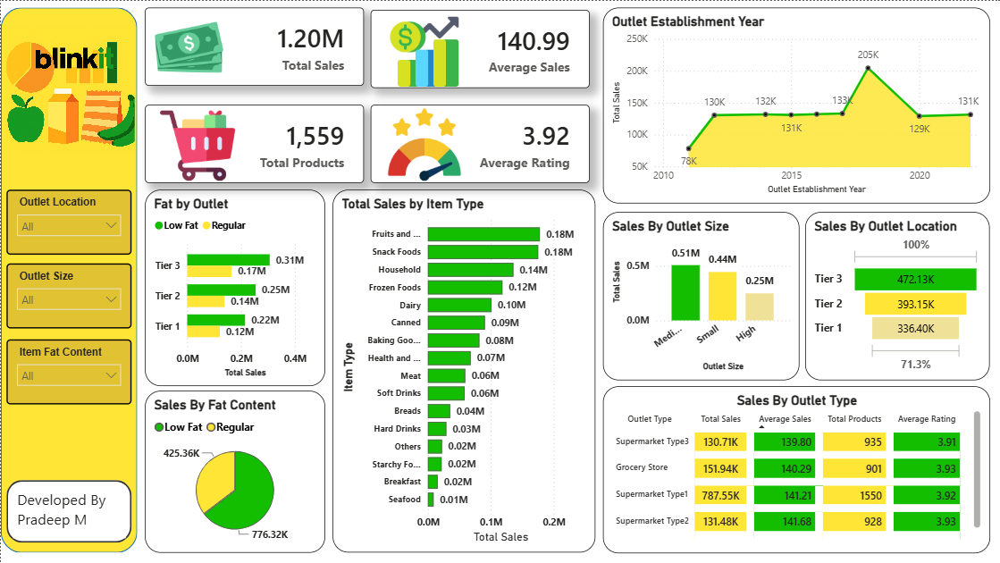

# 🛒 BlinkIT Sales Analytics Dashboard



## **Project Overview**

This project is an end-to-end **Retail Sales Analytics Dashboard** built using **Python, Excel, and Power BI** to analyze BlinkIT grocery sales data. The project focuses on data cleaning, exploratory data analysis (EDA), business intelligence, and interactive dashboard development to uncover valuable business insights.

The dashboard helps understand sales performance, product trends, outlet efficiency, customer preferences, and regional sales distribution to support data-driven decision-making.

---

## **Tools & Technologies**

* **Python**
* **Pandas**
* **NumPy**
* **Matplotlib**
* **Jupyter Notebook**
* **Microsoft Excel**
* **Power BI**
* **DAX**

---

## **Key Features**

* Data cleaning and preprocessing using Python
* Missing value handling and data transformation
* Exploratory Data Analysis (EDA)
* KPI calculation and business metrics
* Interactive Power BI dashboard
* Dynamic slicers and filters
* Sales trend analysis
* Product category analysis
* Outlet performance analysis
* Regional sales insights

---

## **Dashboards and Insights**

### 📊 Dashboard Preview


### 📌 Key Business Insights

* Fruits & Vegetables generated the highest sales.
* Snack Foods ranked as the second highest-selling category.
* Medium-sized outlets contributed the highest revenue.
* Tier 3 locations outperformed Tier 1 and Tier 2 locations in total sales.
* Supermarket Type1 recorded the highest sales among outlet types.
* Outlets established in 2018 showed peak sales performance.
* Low Fat products contributed more revenue than Regular products.

### Dashboard Components

* KPI Cards

  * Total Sales
  * Average Sales
  * Average Rating
  * Total Products

* Interactive Filters

  * Item Fat Content
  * Outlet Size
  * Outlet Type
  * Outlet Location
  * Item Type

* Visualizations

  * Line Charts
  * Bar Charts
  * Donut Charts
  * Matrix Tables
  * KPI Cards
  * Slicers

---

## **Dataset Highlights**

The dataset contains BlinkIT grocery sales information including:

* Item Identifier
* Item Type
* Item Fat Content
* Item Weight
* Item Visibility
* Sales
* Rating
* Outlet Type
* Outlet Size
* Outlet Location Type
* Outlet Establishment Year

### Data Preparation

The following preprocessing steps were performed using Python:

* Checked dataset dimensions and data types
* Identified missing values
* Filled missing Item Weight values using median
* Verified categorical values
* Removed inconsistencies
* Checked duplicate records
* Cleaned and transformed data
* Prepared analysis-ready dataset

---

## **How to Use**

1. Clone this repository:

```bash
git clone https://github.com/yourusername/BlinkIT-Sales-Analytics.git
```

2. Navigate to the project directory.

3. Open the Jupyter Notebook to explore data cleaning and EDA.

4. Access the Power BI report file to interact with the dashboard.

5. Use the dataset for additional analysis and custom visualizations.

---


## **Contact**

### **Pradeep M**

Integrated M.Tech Software Engineering
VIT Vellore

---

### **If you found this project useful, don’t forget to ⭐ star the repository!**
